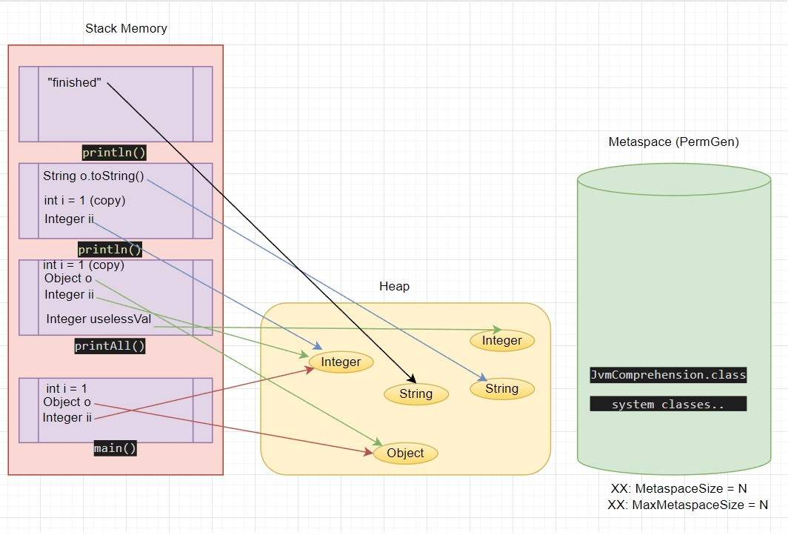

# Задание №1

## Описание задания

Просмотрите код ниже и опишите (текстово или с картинками) каждую строку с точки зрения происходящего в JVM

Не забудьте упомянуть про:

    ClassLoader'ы,
    области памяти (стэк (и его фреймы), хип, метаспейс)
    сборщик мусора

```java

public class JvmComprehension {

    public static void main(String[] args) {
        int i = 1;                      // 1
        Object o = new Object();        // 2
        Integer ii = 2;                 // 3

        printAll(o, i, ii);             // 4
        
        System.out.println("finished"); // 7
    }

    private static void printAll(Object o, int i, Integer ii) {
        Integer uselessVar = 700;                   // 5
        System.out.println(o.toString() + i + ii);  // 6
    }
}

```

## Решение

**1. Загрузка классов**

_JVM должна загрузить в память классы JvmComprehension, Object, Integer, System. Для начала происходит поиск уже загруженных классов в кэше загрузчика, при выполнении поиска определение наличия происходит поэтапно, в случае отсутсвия в кэше при поиске искомого класса выполняется передача задания по поиску к родительскому загрузчику: 
Application ClassLoader -> Platform ClassLoader -> Bootstrap ClassLoader. Ответ с попыткой загруки происходит в обратном порядке Bootstrap ClassLoader-> Platform ClassLoader->Application ClassLoader. Если класс загрузить не удалось (класс не найден), то загрузчик выбросить исключение вида java.lang.ClassNotFoundException_ 

Если стадия загрузки классов прошла успешно, то выполняется стадия связывания: загружаются примитивы - например int и связанные классы из полей класса - например класс PrintStream для System.

**2. Области памяти**



**3. Garbage collector**

Если отталкиваться от схемы, которая изображена выше, и принцыпа очистки устаревших объектов (очищаются объекты, которые по построенному графу не имеют зависимостей (не задействованы) от других объектов), то первой после завершения метода printAll под сборщик попадет переменная uselessVar, потом o.toString() и i, потом "finished" и уже остальные переменные из метода main по его заверщению.